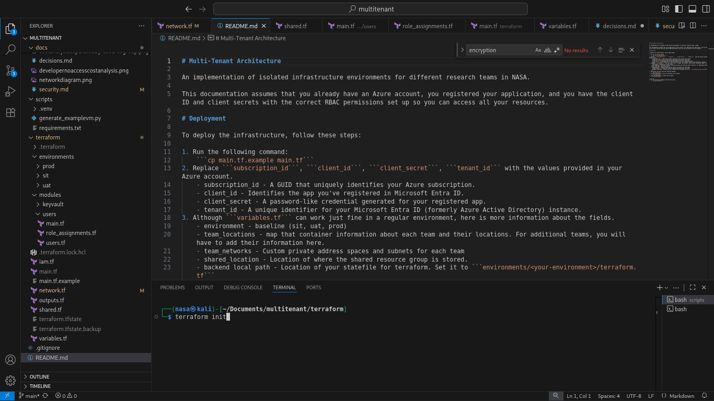
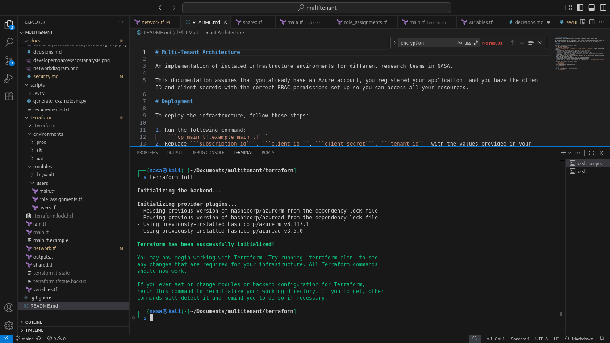
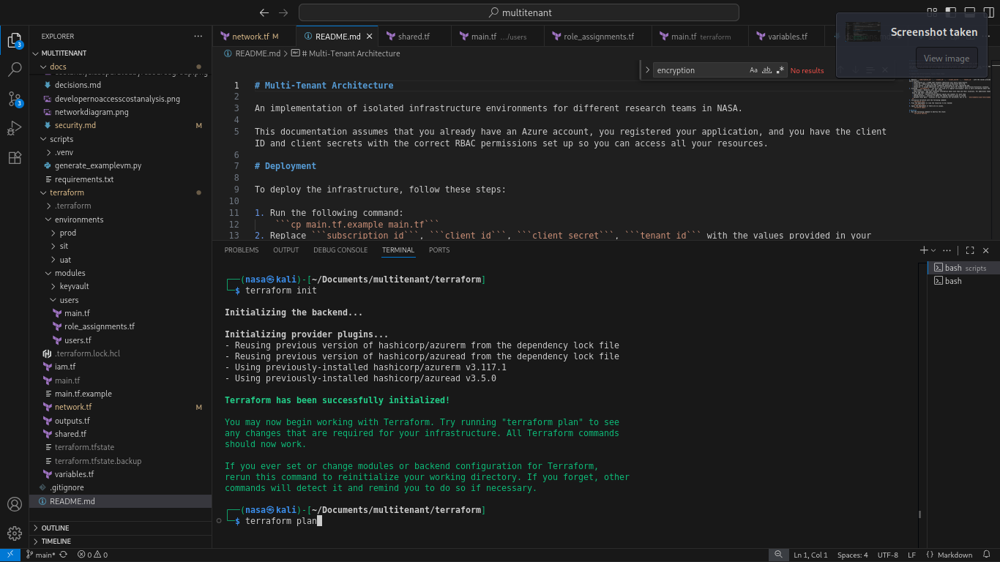
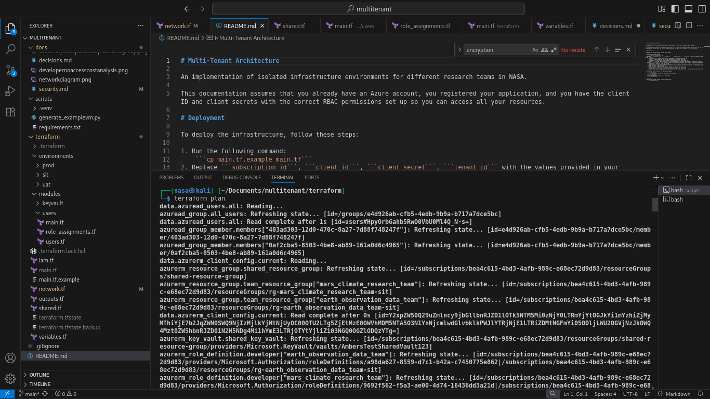
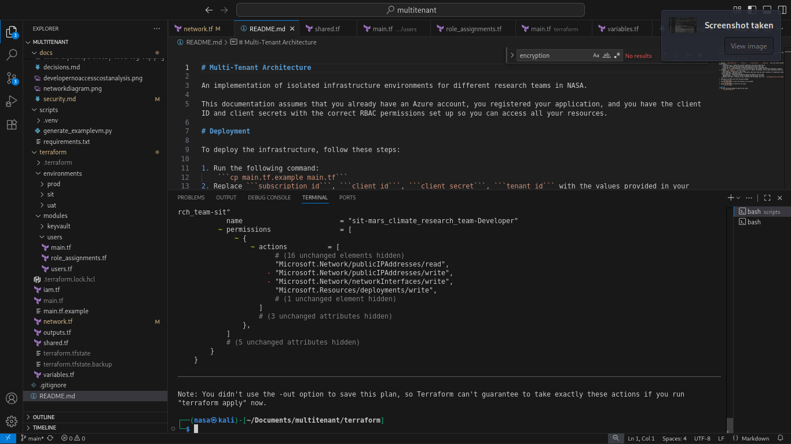
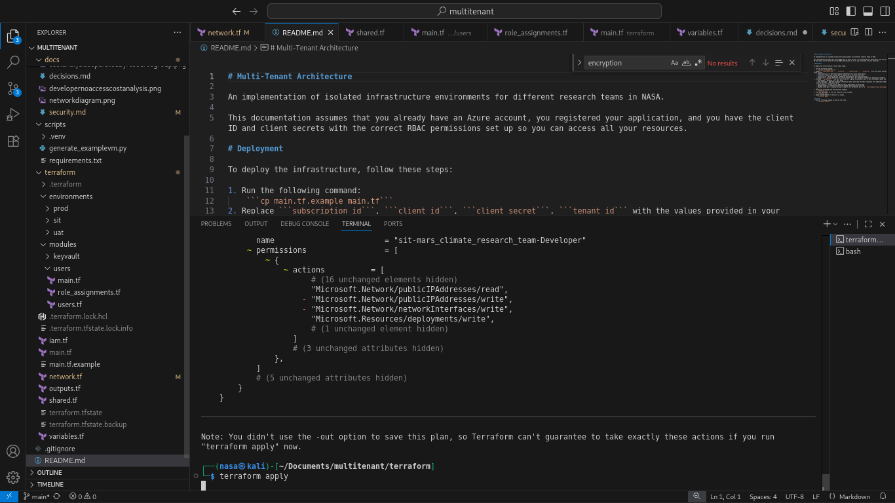
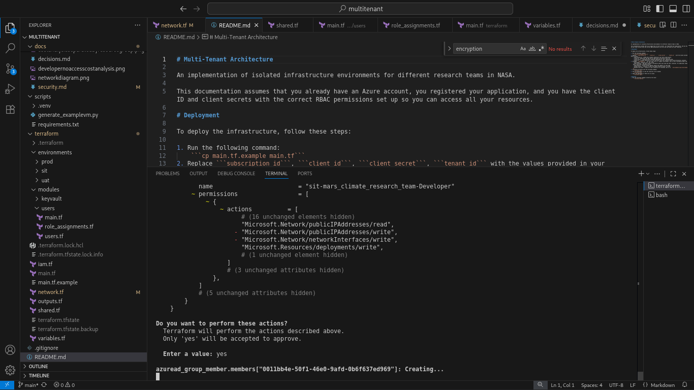
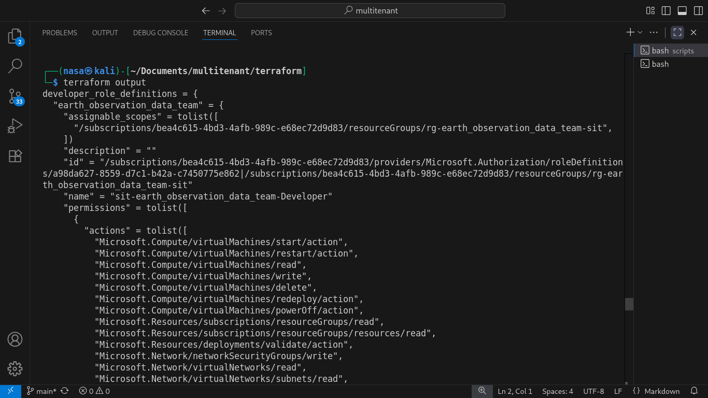

# Multi-Tenant Architecture

An implementation of isolated infrastructure environments for different research teams in NASA.

This documentation assumes that you already have an Azure account, you registered your application, and you have the client ID and client secrets with the correct RBAC permissions set up so you can access all your resources.

# Deployment

To deploy the infrastructure, follow these steps:

1. Run the following command: 
    ```cp main.tf.example main.tf```
2. Replace ```subscription_id```, ```client_id```, ```client_secret```, ```tenant_id``` with the values provided in your Azure account.
    - subscription_id - A GUID that uniquely identifies your Azure subscription.
    - client_id - Identifies the app you've registered in Microsoft Entra ID.
    - client_secret - A password-like credential generated for your registered app.
    - tenant_id - A unique identifier for your Microsoft Entra ID (formerly Azure Active Directory) instance.
3. Although ```variables.tf``` can work just fine in a regular environment, here is more information about the fields.
    - environment - baseline (sit, uat, prod)
    - team_locations - map that container information about each team and their locations. For additional teams, you will have to add their information here.
    - team_networks - Custom private address spaces and subnets for each team
    - shared_location - Location of where the shared resource group is stored.
    - backend local path - Location of your statefile for terraform. Set it to ```environments/<your-environment>/terraform.tf```
4. Initialize terraform with the following command:
    ```terraform init```
    
    
5. Plan the deployment to view the resources to be created:
    ```terraform plan```
    
    
6. Apply the deployment if there are no issues.
    ```terraform apply```
    
    
    
7. If you would like to view the outputs, you can also run the command
    ```terraform output```
    

# Deletion
1. Make sure to run ```terraform init``` if you haven't already
2. Run the following command to destroy the stack:
    ```terraform destroy```