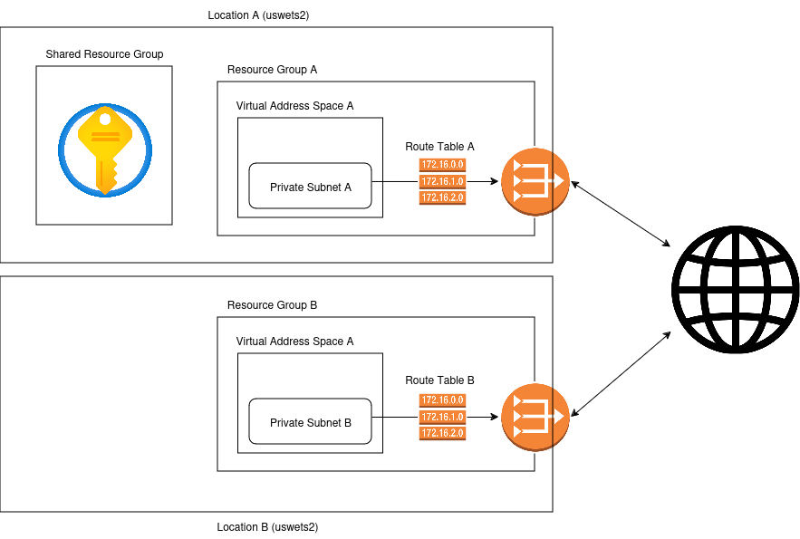

# Architecture Diagram

Each team has a virtual network space with a private network associated with a NAT gateway so users would be able to access traffic outbound without allowing unsolicited inbound traffic.

Team Alpha: Mars Climate Research Team
- Resource Group
- Virtual Network
    - subnet within virtual network
- NAT Gateway
- IAM Roles (Operator, Developer, Readonly)
- Routing Table

Team Alpha: Mars Climate Research Team
- Resource Group
- Virtual Network
    - subnet within virtual network
- NAT Gateway
- IAM Roles (Operator, Developer, Readonly)
- Routing Table

Shared resources
- Key Vault store

