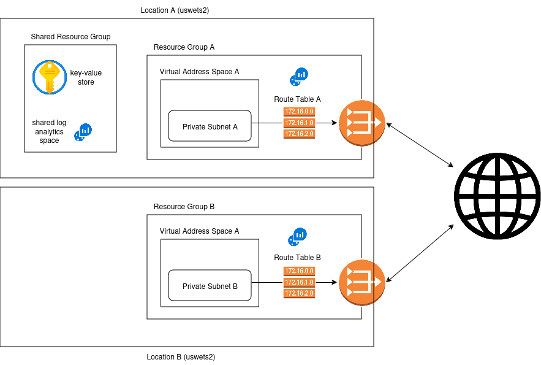

# 🏗️ Architecture Overview

This infrastructure supports a multi-tenant model for scientific research teams, with each team receiving an isolated virtual network environment. The design ensures outbound internet access via NAT gateways while blocking unsolicited inbound traffic, preserving security and autonomy across teams.

---

## 🌐 Per-Team Infrastructure

Each team is provisioned with the following resources:

- **Resource Group**  
  Logical container for managing and tracking resources.

- **Virtual Network (VNet)**  
  Isolated network space for the team, including:
  - Private **subnet** for internal communication

- **NAT Gateway**  
  Enables outbound internet access without exposing internal resources to inbound traffic.

- **IAM Roles**  
  Role-based access control with standardized roles:
  - Operator
  - Developer
  - Read-Only

- **Routing Table**  
  Custom routing rules to manage traffic flow and enforce segmentation.

- **Log Analytics Workspace**  
  Dedicated workspace for monitoring and diagnostics.

### 🧪 Example: Team Alpha — Mars Climate Research

This team’s infrastructure includes all the components listed above, tailored to support Mars climate modeling and data analysis.

---

## 🔗 Shared Resources

These components are centrally managed and accessible across teams:

- **Key Vault**  
  Stores shared secrets such as approved VM image URNs and credentials.

- **Shared Log Analytics Workspace**  
  Provides limited visibility into cross-team metrics for centralized monitoring.

---

## 🖼️ Network Diagram

Visual representation of the multi-tenant architecture:  

