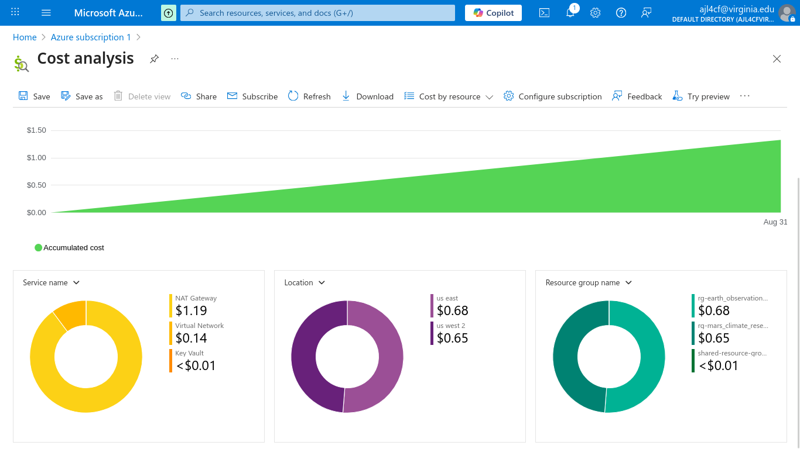

# 🧠 Architectural Decisions

## 🔧 Configuration Management

1. **Daily Deployment Scripts**  
   Deployment scripts are designed to run regularly (daily). Shared resources are updated by querying all users in the system and applying changes to the shared resource group. New users may experience a short delay before their access is reflected.

2. **No `prevent_destroy` Flag (for Now)**  
   Resources are not protected from destruction by default. While `prevent_destroy` would be ideal in a production environment—especially for critical network components—it was omitted here to simplify testing and iteration.

3. **Support for Future Team Expansion**  
   The architecture accommodates new teams by updating `team_networks` and `team_locations` in `variables.tf`. This allows for scalable onboarding without major refactoring.

4. **SIT, UAT, and Production in One Azure Account**  
   Although not recommended for strict isolation, the design assumes that all environments (SIT, UAT, PROD) could coexist within a single Azure account if needed.

---

## 🧱 Design Decisions

1. **Dedicated NAT Gateways per Team**  
   Each team receives its own NAT gateway to isolate traffic, simplify debugging, and support potential billing separation for high-throughput workloads.

2. **Standardized IAM Roles Across Teams**  
   All teams are assigned the same role set: Operator, Developer, and Read-Only. Custom roles can be added by a DevOps engineer, but would apply globally across all teams.

3. **Shared Key Vault for Approved Resources**  
   A centralized Key Vault stores vetted Azure VM image URNs and other shared secrets. This prevents teams from deploying outdated or insecure configurations and streamlines provisioning.

4. **Resource Groups for Cost Visibility**  
   Each team’s resources are grouped separately to enable granular cost analysis.  
   

5. **Dual Log Analytics Workspaces**  
   Teams have access to both their own log analytics workspace and a shared workspace. This balances visibility with security, allowing teams to monitor their own usage while accessing limited insights across the broader environment.

---

## 🚀 Future Enhancements

1. **User & Role Assignment Module**  
   A dedicated module for managing users and roles would improve resilience and simplify recovery if the Azure account were compromised or reset.

2. **Fix NAT Gateway Assignment Bug**  
   NAT gateways are not consistently attached to subnets during deployment. This currently requires manual intervention post-deployment.

3. **Enable `prevent_destroy` on Critical Resources**  
   To protect tenant environments, most resources should be flagged with `prevent_destroy` once the infrastructure is stable.

4. **Move Terraform State to Azure Backend**  
   Storing statefiles in Azure enables collaboration and improves reliability. The current local backend is suitable for testing but not production.

5. **Expand Routing Table Configuration**  
   Only basic routing rules are currently implemented. A more comprehensive setup would improve traffic control and security posture.

6. **Application Testing Not Yet Implemented**  
   A test application was planned but not completed due to time constraints.

---

## 🤖 Appendix: How AI Was Used

- **Learning Azure Concepts**  
  As someone new to Azure, I used AI tools to bridge the gap between AWS familiarity and Azure-specific terminology.

- **Code Validation & Troubleshooting**  
  AI helped identify missing Terraform blocks and potential misconfigurations.

- **Architectural Brainstorming**  
  I used Copilot as a sounding board to evaluate trade-offs between resource types, security models, and maintainability.

---

## ⚠️ Appendix: Challenges

1. **Complex Role Assignment Permissions**  
   Provisioning VMs required extensive permission setup. Custom roles took longer than expected due to Azure’s RBAC intricacies.

2. **Azure CLI vs. Portal**  
   The Azure CLI proved more efficient than the UI for tasks like role assignments. The portal was often unintuitive and slower to navigate.
