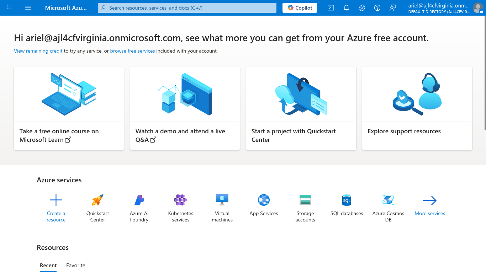
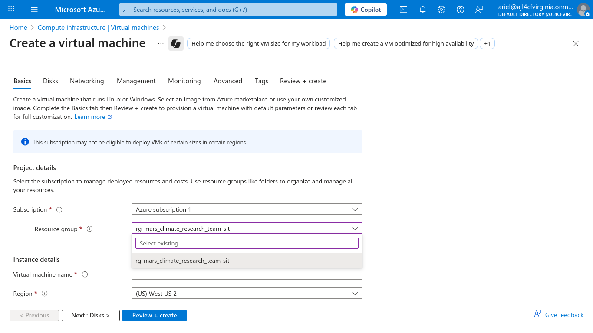
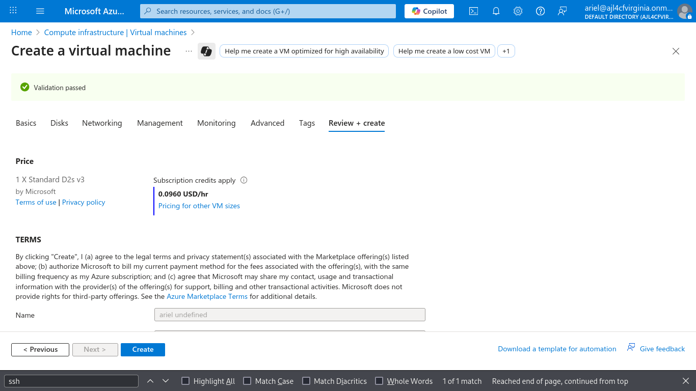
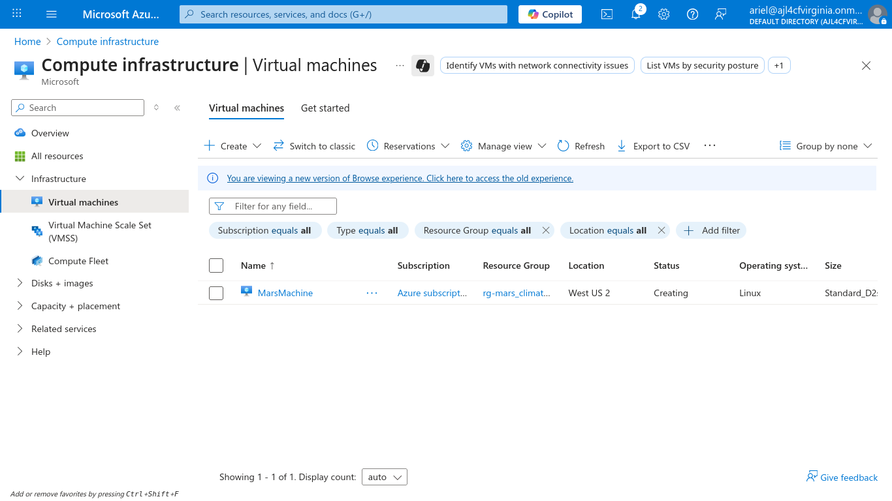
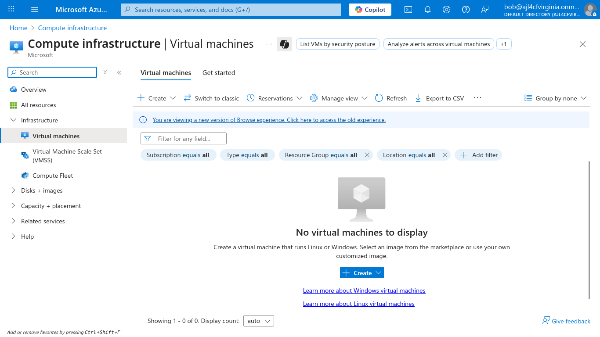
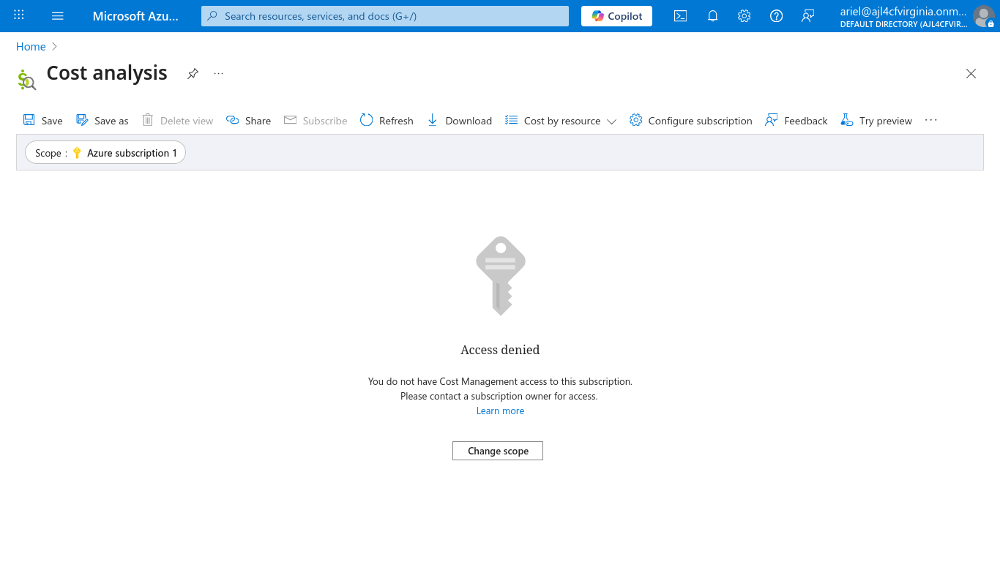

# 🔐 Security Overview

## 🛡️ Compliance Assumptions

This infrastructure is designed for scientific research (e.g., Mars exploration, Earth observation) and does **not involve PII or health data**. As such:

- **HIPAA compliance is not required**
- **Resources are private by default**
- **Encryption at rest and complex auditing are not enforced**, given the lower sensitivity of the data

This approach reflects a **risk-based security model**, balancing protection with operational simplicity.

---

## 🧰 Security-Enabling Resources

### 📍 Route Tables

Route tables restrict which subnets or networks are reachable. By **omitting routes to sensitive resources**, you effectively isolate them — a concept known as **security by absence of a path**.

This principle is widely used in cloud environments (e.g., AWS VPC route tables) to enforce segmentation and reduce exposure.

---

### 🔥 Network Security Groups (NSGs)

NSGs act as **stateful firewalls** at the subnet or network interface level. They:

- Control inbound/outbound traffic via allow/deny rules
- Filter by IP, port, and protocol
- Enforce **least privilege** at the network layer

This minimizes the attack surface and limits lateral movement between workloads.

---

### 🌐 NAT Gateway

A NAT gateway enables **outbound internet access** from private subnets without exposing them to unsolicited inbound traffic.

- Internal hosts can initiate outbound traffic
- External hosts **cannot initiate inbound connections**
- NAT translates private IPs to a shared public IP

This design supports secure updates, API calls, and telemetry without compromising workload isolation.

---

### 👥 User Roles & RBAC

Role-based access control (RBAC) ensures users only have permissions necessary for their responsibilities.

- Limits damage from compromised credentials or human error
- Enforces **least privilege**
- Centralizes policy enforcement across teams

Roles are defined as Operator, Developer, and Read-Only, with potential for expansion.

---

## 📸 Screenshots

### 🔐 Team Alpha Login
Fictional Team Alpha member logs into her account.  

---

### 🧭 Team Alpha VM Creation
Team Alpha member can only see her own resource group during VM provisioning.  
  
  

---

### 🚫 Team Beta Access Restriction
Team Beta member cannot view Team Alpha’s virtual machines.  

---

### 🔒 Developer Role Restrictions
Developers are restricted from accessing pages outside their permissions.  

